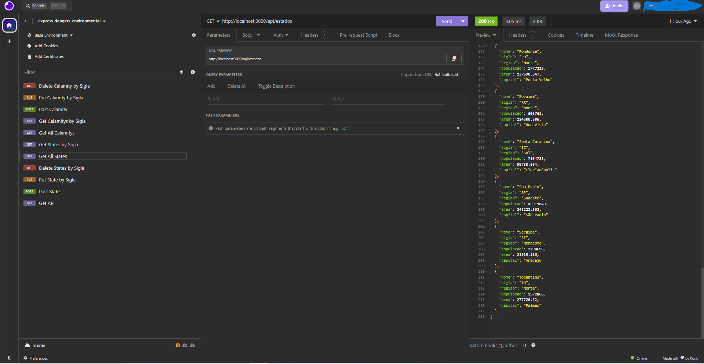

# API sobre problemas ambientais no Brasil
#### 17/06/2024 - Status: Funcionando

## Iniciar servidor

```node
node --watch app.js
```

## Informações

API estruturada com as seguintes rotas:

Rota padrão para verificar o funcionamento e mostrar insformações da API

- http://localhost:3000/

Rota que retorna todos os estados da Brasil com algumas informações básicas

- http://localhost:3000/api/estados

Rota que retorna algumas catastrofes que asolaram determinador estado

- http://localhost:3000/api/calamidades


## Modelagem da rota - states

Field | Description
------|------------
nome | nome do estado
sigla | sigla do estado
regiao | região norte, nordeste, sul, sudeste ou centro-oeste
populacao | quantidade de pessoas no estado
area | tamanho do territorio
capital | a capital do estado


```json
{
    "nome": "Acre",
    "sigla": "AC",
    "regiao": "Norte",
    "populacao": 881935,
    "area": 164123.04,
    "capital": "Rio Branco"
}


## Modelagem da rota - calamitys

Field | Description
------|------------
estado | nome do estado
sigla | sigla do estado
calamidade | tipo de calamidade como seca, inundação, enchente, etc.
ano | ano que aconteceu a calamidade
afetados | quantidade de pessoas afetadas


```json
{
    "estado": "Santa Catarina",
    "sigla": "SC",
    "calamidade": "inundação",
    "ano": 2008,
    "afetados": 1500000
}


## API testada e documentada no insomnia

